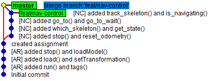
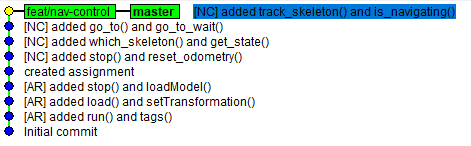

🎓 Training on Advanced Git
============================

[@robotology-bot][1] and [@vvv-school-bot][2] left the company and you have been just hired to take them over 😆

The "bots" were developing a new feature to enable navigation control, [**each bot on his own branch**][9]. The feature is deemed complete but still **needs to be integrated in `master`**.

The repository maintainer [@pattacini][3] requires you to demonstrate your skills with Git by merging the new feature into `master`. In particular, you ought to:
- work in a dedicated **sandbox environment (a fork)**.
- make sure that the resulting **`master` will have the most linear history possible** (see below).

To complete the assignment do:
1. [Fork][4] this repository to your own account. The following actions are to be taken in your forked repository.
2. Merge the two concurrent lines of development carried out in the two branches `robotology-bot/nav-control` and `vvv-school-bot/nav-control` into a unique branch called `feat/nav-control`. The branch `feat/nav-control` is required to have a [linear history][5].
3. [Rebase][6] `feat/nav-control` on `master`.
4. [Create a pull request][7] (**PR**) with `master` as _base branch_ and `feat/nav-control` as _compare branch_. ⚠ Be careful that the base branch needs to be the one in your fork.
5. [Request to review your PR][8] 👋 to turn in the assignment.

#### Resulting linear histories of `master` branch
| merge of `feat/nav-control` w/ option `--no-ff` | merge of `feat/nav-control` |
|:---:|:---:| 
|  |  |

[1]: https://github.com/robotology-bot
[2]: https://github.com/vvv-school-bot
[3]: https://github.com/pattacini
[4]: https://help.github.com/en/github/getting-started-with-github/fork-a-repo
[5]: https://www.bitsnbites.eu/a-tidy-linear-git-history/
[6]: https://help.github.com/en/github/using-git/about-git-rebase
[7]: https://help.github.com/articles/creating-a-pull-request
[8]: https://help.github.com/articles/requesting-a-pull-request-review
[9]: https://github.com/pattacini/training-git-advanced/network
